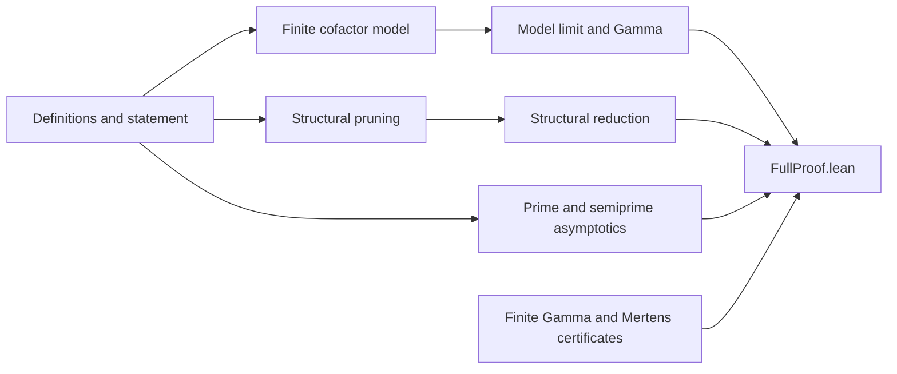

# Proof map

The source modules stay in one Lean namespace so the audited import graph is
unchanged. This page groups them by mathematical role.

## Definitions and statement

- `Core.lean` defines admissibility, $g_3$, compatible cofactor families,
  model scores, and $\Gamma$.
- `Statement.lean` encodes the second-order asymptotic as a limit.
- `Model.lean`, `Lift.lean`, and `Extremal.lean` define the finite model and
  connect compatible families to admissible sets.
- `MainReduction.lean` gives the algebraic assembly theorem for the three
  required limiting components.

## Structural reduction

- `C4Free.lean`, `KST.lean`, `CompleteBox.lean`, and
  `CompleteBoxBound.lean` provide the extremal graph/hypergraph estimates.
- `PairwiseOverlap.lean`, `AdmissibleTriples.lean`, `TriplePruning.lean`,
  and `DyadicBoxes.lean` control factor-shape overlaps.
- The `Pruning*`, `*Budget*`, `*Error*`, `CollisionCleaning.lean`, and
  `Smooth*` modules implement and quantify the normal-form reduction.
- `StructuralReductionBridge.lean` and `StructuralFiniteBound.lean` close
  the structural limit needed by the final assembly.

## Cofactor model and variational constant

- `CanonicalExtension.lean`, `CanonicalCompatibility.lean`, and
  `BucketCompression.lean` control finite compatible prefixes.
- `GammaBasic.lean`, `CofactorFunctional.lean`, `CofactorMajorant.lean`,
  `GammaBound.lean`, and `GammaFinite.lean` establish that $\Gamma$ is a
  finite real constant.
- `ModelLimitFinite.lean`, `ModelPositiveTail.lean`,
  `CanonicalModelLimit.lean`, and `CofactorModelLimitProof.lean` prove
  convergence of the finite model to $\Gamma$.
- `Certificate.lean`, `CertificateScore.lean`, and `GammaCertificate.lean`
  check the explicit family giving $\Gamma\geq4/15$.
- `GammaExplicitUpper.lean` proves $\Gamma<13$.

## Analytic baseline

- `Baseline.lean`, `BaselineIdentity.lean`, and `BaselineAsymptotic.lean`
  express the prime/semiprime baseline.
- `PrimeNumberTheoremProof.lean` transports the prime number theorem into
  the exact natural-variable normalization used here.
- The `Semiprime*` modules prove the required second-order semiprime
  asymptotic.
- `MeisselMertensProof.lean`, `PrimeHarmonicSqrt.lean`, and
  `PrimeLogCorrection.lean` supply the Meissel--Mertens term.
- `MertensCutoffCertificate.lean` and `MertensExplicitUpper.lean` prove the
  explicit bound $M<933/1000$ without using an Euler-product identity.

## Final assembly

`FullProof.lean` imports the independently proved components and exposes the
release theorems. The executable audit imports this module directly; the
small top-level `Erdos796.lean` file is retained as the frozen statement
umbrella.
